# 👁‍🗨Datawhale AI夏令营——零基础入门大模型技术竞赛

#AI夏令营 #Datawhale #夏令营

***

## 学习方式及任务安排

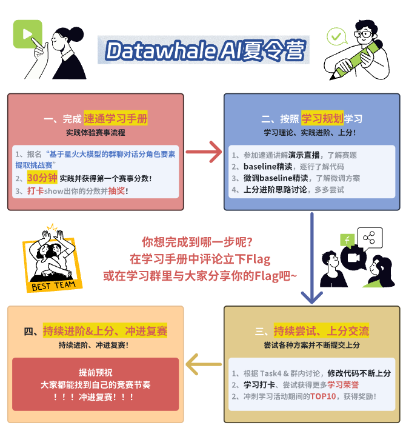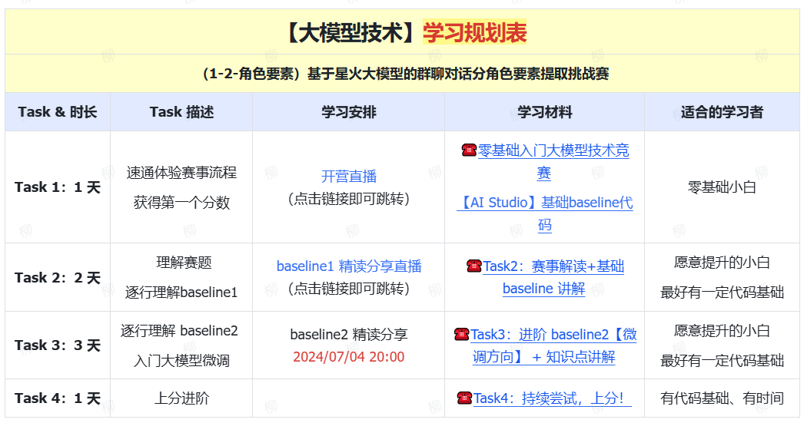

***

## 学习参考

赛事链接：[报名赛事](https://challenge.xfyun.cn/h5/detail?type=role-element-extraction&ch=dw24_y0SCtd)

学习手册：[‍‬⁠‌‍⁠‍⁠‬‬⁠‌⁠‌⁠‍‌‍‍‬⁠⁠‌⁠‬‬‍⁠‍⁠零基础入门大模型技术竞赛 - 飞书云文档 (feishu.cn)](https://datawhaler.feishu.cn/wiki/VIy8ws47ii2N79kOt9zcXnbXnuS)

领取大模型API：[星火控制台](https://console.xfyun.cn/app/myapp)

### 夏令营简介

本次课程学习主要是面向对大模型技术感兴趣的开发者，旨在基于星火大模型，结合个人学习进行项目制学习，由浅入深，逐渐进阶。最终完成赛事任务——**群聊对话分角色的进行要素提取**。独自对大模型进行微调得到超越baseline的得分开发。总体的任务可以分为以下的四部分：

1. 小白零基础体验Baseline
2. 赛事解读+基础Baseline讲解
3. 进阶Baseline2微调
4. 持续尝试，上分！

***

## Task1、Basline体验

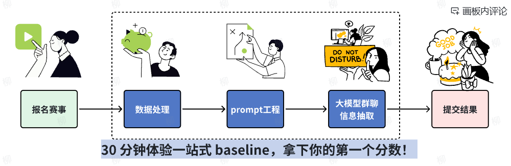

首先，附上体验地址：https://aistudio.baidu.com/projectdetail/8095619

填写完完整的信息之后，直接选择运行项目即可。本次的赛事任务主要是针对**群聊对话分角色的进行要素提取**。可以在左侧的文件栏看到我们的训练集和测试集

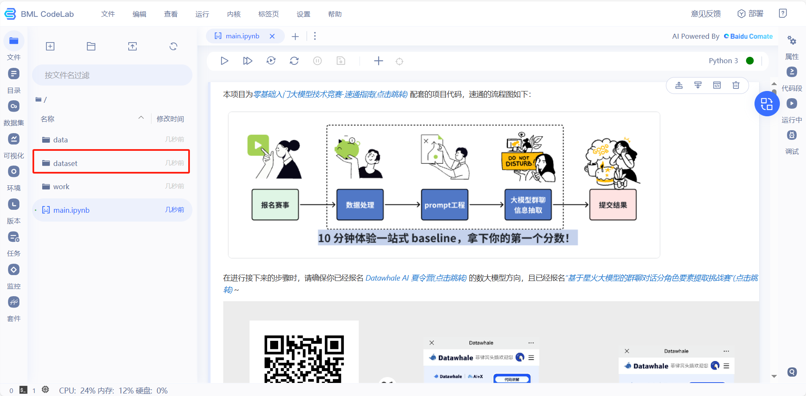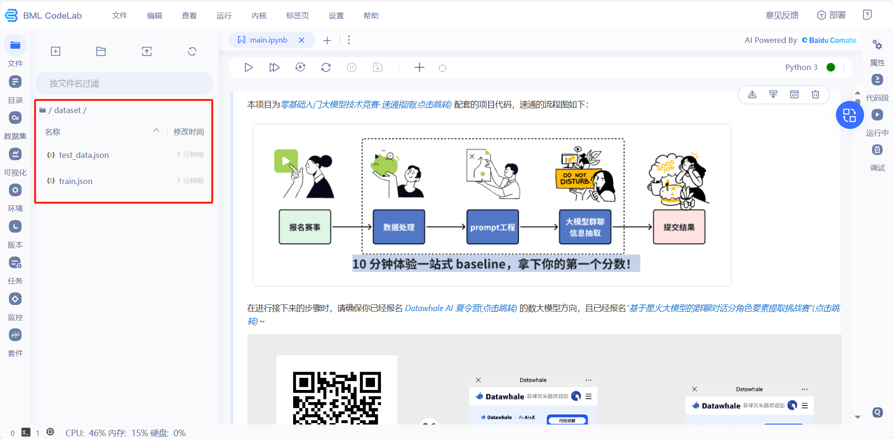

点开训练集，我们发现内容是非常复杂的，包含了各种聊天信息的集合。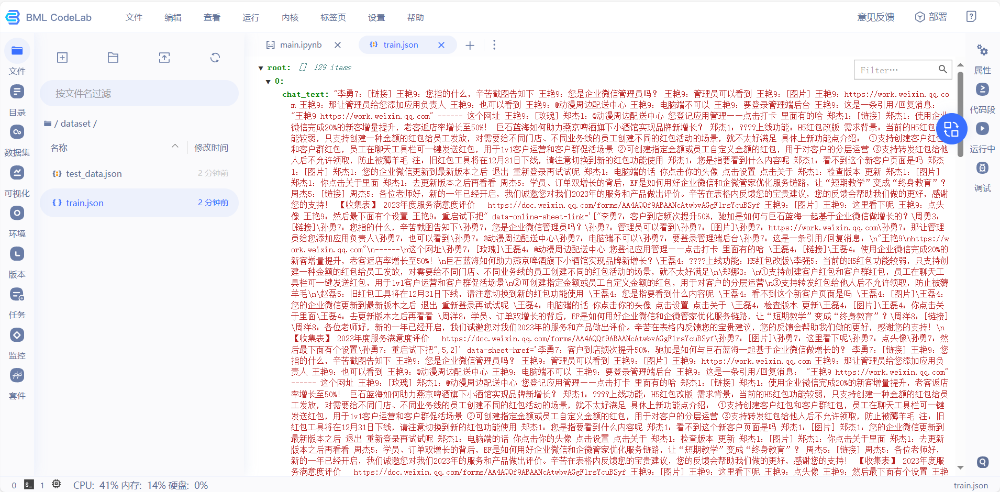

然后回到我们的项目代码进行运行，<font color="blue">注意：这里需要填上你申请的星火大模型的API信息。</font>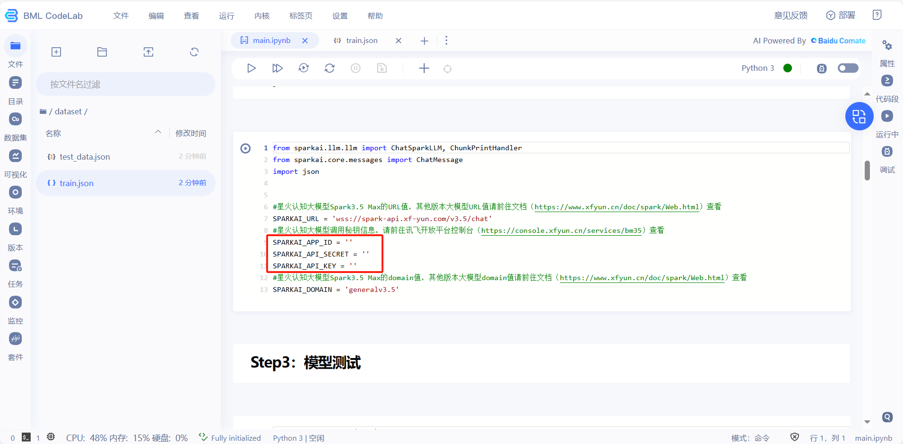

整体的Baseline过程可以简述为：`配置环境` => `数据读取` => `Prompt设计` => `调用大模型` => `生成提交文件` => `提交结果`。这几部分 。下面是我提交结果后的第一次成绩：

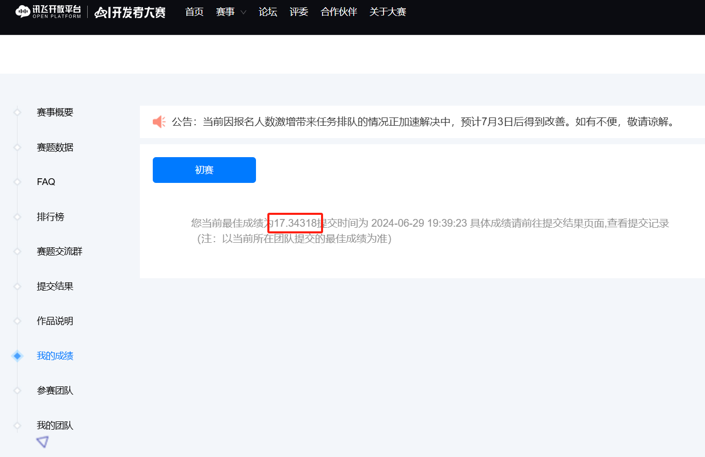

只能说是Baseline给了我们很大的上升空间。

## Task2、赛事解读+Baseline讲解

### 2.1 赛事背景

在数字化时代，企业积累了大量对话数据，这些数据不仅是交流记录，还隐藏着宝贵的信息。群聊对话分角色要素提取是企业营销和服务的重要策略，通过分析这些数据，企业可以更好地理解客户需求，提供个性化服务，提升客户满意度和商业价值。

### 2.2 赛事任务

从给定的<客服>与<客户>的群聊对话中，提取出指定的字段信息，具体待提取的字段如下所示。

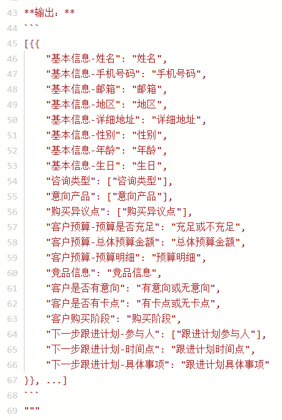


参赛选手需**基于讯飞星火大模型Spark Max**完成任务，可使用大模型微调。报名参赛选手将获得API和微调训练资源福利，详情请登录[讯飞开放平台](https://www.xfyun.cn/)和[大模型训练平台](https://training.xfyun.cn/overview)查看。其中赛题提供了184条真实场景的群聊对话数据，需要我们对数据进行读取、清洗以及要素提取。

### 2.5 Baseline讲解

赛事提供的Baseline：[基于星火大模型的群聊对话分角色要素提取挑战-baseline](https://aistudio.baidu.com/projectdetail/8090362?sUid=784476&shared=1&ts=1719309432555)，首先我们可以读取比赛提供的.json文件查看对话内容：

```python
import json

def read_json(json_file_path):
    """读取json文件"""
    with open(json_file_path, 'r') as f:
        data = json.load(f)
    return data

def write_json(json_file_path, data):
    """写入json文件"""
    with open(json_file_path, 'w') as f:
        json.dump(data, f, ensure_ascii=False, indent=4)

# 读取数据
train_data = read_json("dataset/train.json")
test_data = read_json("dataset/test_data.json")

# 查看对话数据
print(train_data[100]['chat_text'])
```

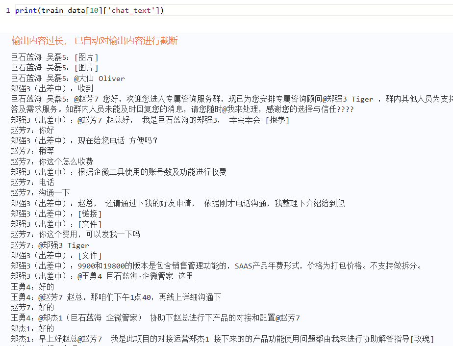

可以看到提供的.json文件中包含了大量的对话信息，所以对其进行有效的提取还是充满挑战的，接下来设计`prompt`输入给大模型来提取要素，下面的是baseline提供的prompt：

````python
# prompt 设计
PROMPT_EXTRACT = """
你将获得一段群聊对话记录。你的任务是根据给定的表单格式从对话记录中提取结构化信息。在提取信息时，请确保它与类型信息完全匹配，不要添加任何没有出现在下面模式中的属性。

表单格式如下：
info: Array<Dict(
    "基本信息-姓名": string | "",  // 客户的姓名。
    "基本信息-手机号码": string | "",  // 客户的手机号码。
    "基本信息-邮箱": string | "",  // 客户的电子邮箱地址。
    "基本信息-地区": string | "",  // 客户所在的地区或城市。
    "基本信息-详细地址": string | "",  // 客户的详细地址。
    "基本信息-性别": string | "",  // 客户的性别。
    "基本信息-年龄": string | "",  // 客户的年龄。
    "基本信息-生日": string | "",  // 客户的生日。
    "咨询类型": string[] | [],  // 客户的咨询类型，如询价、答疑等。
    "意向产品": string[] | [],  // 客户感兴趣的产品。
    "购买异议点": string[] | [],  // 客户在购买过程中提出的异议或问题。
    "客户预算-预算是否充足": string | "",  // 客户的预算是否充足。示例：充足, 不充足
    "客户预算-总体预算金额": string | "",  // 客户的总体预算金额。
    "客户预算-预算明细": string | "",  // 客户预算的具体明细。
    "竞品信息": string | "",  // 竞争对手的信息。
    "客户是否有意向": string | "",  // 客户是否有购买意向。示例：有意向, 无意向
    "客户是否有卡点": string | "",  // 客户在购买过程中是否遇到阻碍或卡点。示例：有卡点, 无卡点
    "客户购买阶段": string | "",  // 客户当前的购买阶段，如合同中、方案交流等。
    "下一步跟进计划-参与人": string[] | [],  // 下一步跟进计划中涉及的人员（客服人员）。
    "下一步跟进计划-时间点": string | "",  // 下一步跟进的时间点。
    "下一步跟进计划-具体事项": string | ""  // 下一步需要进行的具体事项。
)>

请分析以下群聊对话记录，并根据上述格式提取信息：

**对话记录：**
```
{content}
```

请将提取的信息以JSON格式输出。
不要添加任何澄清信息。
输出必须遵循上面的模式。
不要添加任何没有出现在模式中的附加字段。
不要随意删除字段。

**输出：**
```
[{{
    "基本信息-姓名": "姓名",
    "基本信息-手机号码": "手机号码",
    "基本信息-邮箱": "邮箱",
    "基本信息-地区": "地区",
    "基本信息-详细地址": "详细地址",
    "基本信息-性别": "性别",
    "基本信息-年龄": "年龄",
    "基本信息-生日": "生日",
    "咨询类型": ["咨询类型"],
    "意向产品": ["意向产品"],
    "购买异议点": ["购买异议点"],
    "客户预算-预算是否充足": "充足或不充足",
    "客户预算-总体预算金额": "总体预算金额",
    "客户预算-预算明细": "预算明细",
    "竞品信息": "竞品信息",
    "客户是否有意向": "有意向或无意向",
    "客户是否有卡点": "有卡点或无卡点",
    "客户购买阶段": "购买阶段",
    "下一步跟进计划-参与人": ["跟进计划参与人"],
    "下一步跟进计划-时间点": "跟进计划时间点",
    "下一步跟进计划-具体事项": "跟进计划具体事项"
}}, ...]
```
"""
````

完成之后，我们调用大模型进行初步的Baseline测试，并进行分数测试，这里我同时放上了我微调了一下prompt之后的结果对比 (16.40606是微调了prompt的，17.34318是baseline的)：

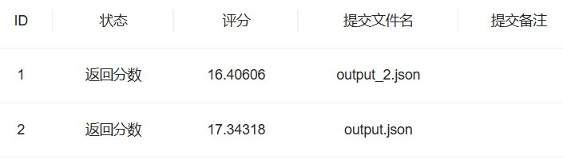

我先分析一下自己通过调节Prompt来进行微调的一个实验结果，调整prompt中的提取步骤为①②③的思维链格式:

````python
请你依次执行以下步骤：
①请分析以下群聊对话记录，并根据上述格式提取信息，确保提取的信息和表单属性类型完全匹配，不要试图编造信息。
**对话记录：**
```
{content}
```
②基于提供的内容，反思回答中提取的信息有没有不正确或者不完全匹配的内容，如果有则根据正确的和完全匹配的内容对不正确的部分进行修正。

③严格按照以下要求输出：
请将提取的信息根据给定的输出格式以一个可解析的JSON格式输出，不要添加任何澄清信息，输出必须遵循上面的模式，不要添加任何没有出现在模式中的附加字段，不要随意删除字段。
````

截取了两份，提取出来的要素对比如下：左边是baseline，右边是微调了prompt：

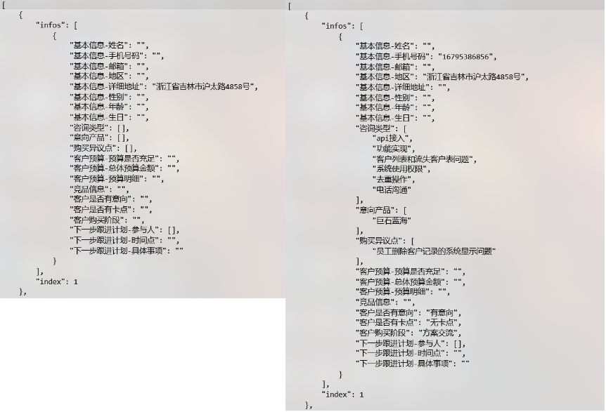

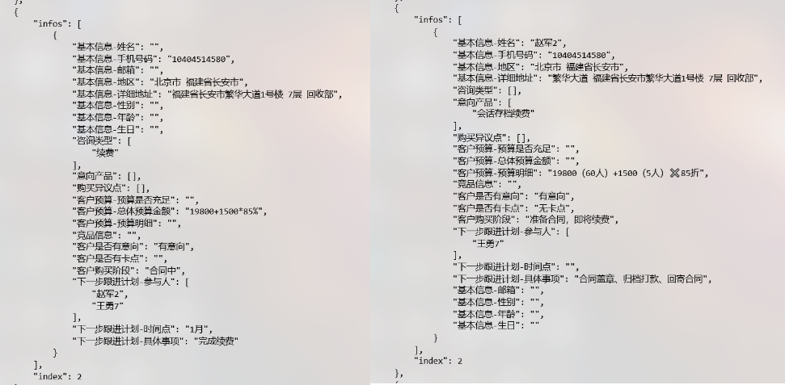


## Task3、进阶Baseline2微调

微调部分我也是参考的教程中的微调，主要从数据集的二次制作以及模型训练微调两部分进行优化。

对原群聊对话设计了一个总结Prompt，目的是将原始对话内容进行精简。方便做微调数据。一方面直接将群聊对话作为数据集的话，会导致上下文过长，超过限制。还有上下文太长会导致抽取效果变差。过长的上下文也会导致训练时长和费用倍增。将对话中的内容按照测试结果表单的要求划分为了以下四部分：

* **客户基本信息**：包括姓名、手机号码、邮箱、地区、详细地址、性别、年龄和生日。
* **客户意向与预算信息**： 包括咨询类型、意向产品、购买异议点、预算是否充足、总体预算金额以及预算明细。
* **客户购买准备情况**：包括竞品信息、客户是否有意向、客户是否有卡点以及客户购买阶段。
* **跟进计划信息**： 包括参与人、时间点和具体事项。

对应的`Prompt`如下所示：

```python
content = ''
prompt = f'''
你是一个数据分析大师，你需要从群聊对话中进行分析，里面对话的角色中大部分是客服角色，你需要从中区分出有需求的客户，并得到以下四类数据。

****群聊对话****
{content}

****分析数据****
客户基本信息：需要从中区分出客户角色，并得到客户基本信息，其中包括姓名、手机号码、邮箱、地区、详细地址、性别、年龄和生日
客户意向与预算信息： 客户意向与预算信息包括咨询类型、意向产品、购买异议点、预算是否充足、总体预算金额以及预算明细
客户购买准备情况：户购买准备情况包括竞品信息、客户是否有意向、客户是否有卡点以及客户购买阶段
跟进计划信息： 跟进计划信息包括参与人、时间点和具体事项，这些信息用于指导销售团队在未来的跟进工作中与客户互动

****注意****
1.只输出客户基本信息、客户意向与预算信息、客户购买准备情况、跟进计划信息对应的信息，不要输出无关内容
2.不要输出分析内容
3.输出内容格式为md格式
'''
```

完成prompt设计后，对应的制作我们读取原始数据集，并生产新的数据集：

```python
# 训练集制作
import json

# 打开并读取JSON文件
with open('train.json', 'r', encoding='utf-8') as file:
    data = json.load(file)

# 打开一个文件用于写入，如果文件已存在则会被覆盖
with open('traindata.jsonl', 'w', encoding='utf-8') as file:
    # 训练集行数(130)不符合要求，范围：1500~90000000
    # 遍历数据列表，并将每一行写入文件
    # 这里为了满足微调需求我们重复12次数据集 130*12=1560
    
    for line_data in tqdm(data):
        line_input = line_data["chat_text"] 
        line_output = line_data["infos"]
        content = line_input
        res = chatbot(prompt=prompt)
        # print(res)
        line_write = {
            "instruction":jsonl_data["instruction"],
            "input":json.dumps(res, ensure_ascii=False),
            "output":json.dumps(line_output, ensure_ascii=False)
        }
        # 因为数据共有130行，为了能满足训练需要的1500条及以上，我们将正常训练数据扩充12倍。
        for time in range(12):
            file.write(json.dumps(line_write, ensure_ascii=False) + '\n')  # '\n' 用于在每行末尾添加换行符
```

然后将训练集和测试集上传进行训练即可。

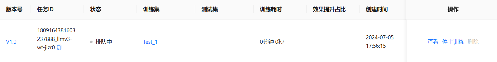

训练完成后使用重新训练的模型，对数据集进行要素提取，对比结果如下所示：


